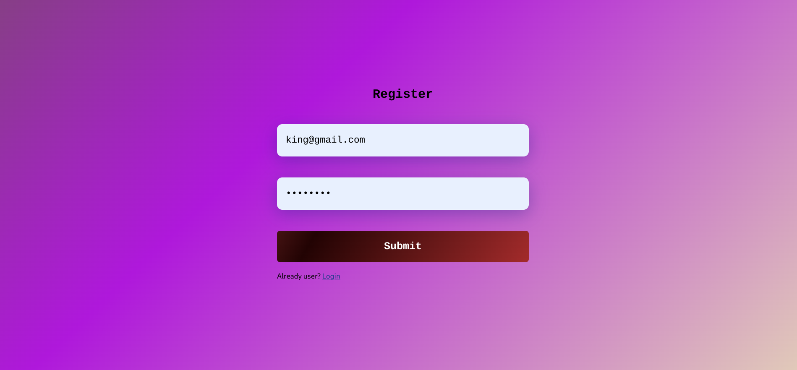
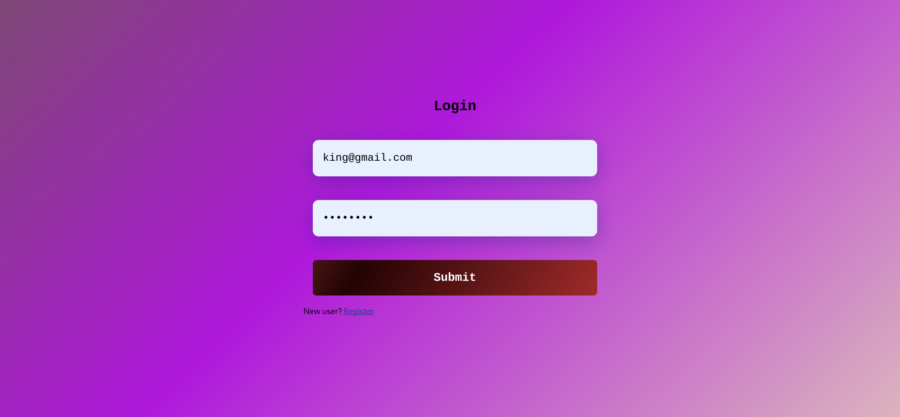
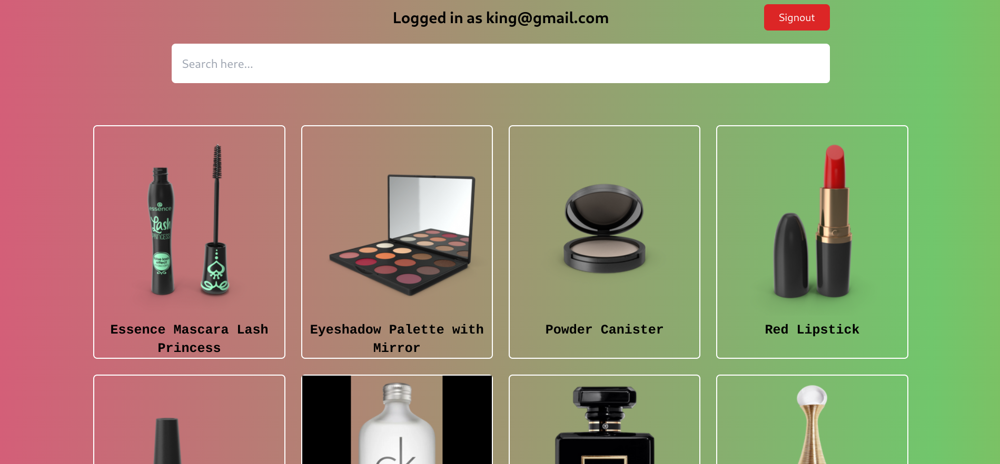

# Engineer's Cradle Hiring Task (Frontend)

This project is focused on building a **responsive web application** with user authentication and product listing features. It demonstrates client-side search functionality, pagination, and an interactive UI, ensuring a smooth user experience.

---

## 📦 Deployment

The project is deployed using **Netlify**.  
🔗 [\[https://engineers-cradle.netlify.app\]](https://engineers-cradle.netlify.app)

---

## 🔗 API & Documentation

- **Postman Documentation**:  
  [Explore API Documentation](https://documenter.getpostman.com/view/30201398/2sA3kbgydJ)

- **Base API URL**:  
  [https://intern-task-api.bravo68web.workers.dev/](https://intern-task-api.bravo68web.workers.dev/)

---

## 🚀 Features Overview

### **1. Registration Page**
Users can create an account by providing their email and password. The design follows the required layout.  

### **2. Login Page**
Registered users can log in to their account to access the product listing page.  

### **3. Product Listing Page**
Displays a list of products with their **title**, **price**, and **image**. Includes:
- **AJAX search**: Allows users to filter products by their title.
- **Client-side pagination**: Displays 8 products per page.
- Displays the **logged-in user's email**.  

---

## 💡 Key Requirements

- **Responsive Design**: Ensure the website works across various device sizes.
- **Product Page**: 
  - **Tilted Price Tag**: Display the price with a distinct tilted style.
  - **Search Functionality**: Implement a client-side search that filters products by their title using AJAX.
  - **Pagination**: Each page should display a maximum of 8 products.
  - **User Email Display**: Show the logged-in user’s email on the product listing page.
  
---

## 🛠️ Tech Stack

- **Frontend**: 
  - React 
    - fetch api
  - TailwindCSS
- **Deployment Platforms**: 
  - Netlify

---

## 📦 Deployment

The project is deployed using **Netlify**.  
🔗 [\[https://engineers-cradle.netlify.app\]](https://engineers-cradle.netlify.app)

---

## Some Info
- During build the logic and UI, I chnaged some design components and logic. I have not deleted that logic but those are seperated from the main logic.

